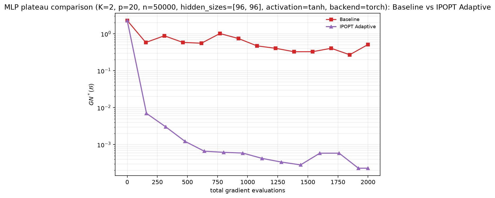
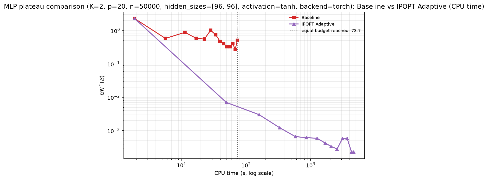

# d11522_h96x96_tanh_n50000_B2000

## Parameters

```json
{
  "K": 2,
  "p": 20,
  "n": 50000,
  "hidden_sizes": [
    96,
    96
  ],
  "activation": "tanh",
  "coarse_resolution": 10,
  "n_passes": 100000,
  "steps_per_point_per_pass": 5,
  "max_grad_evals": 2000,
  "baseline_eval_every_n_grads": 153,
  "adaptive_eval_every_n_grads": 153,
  "max_outer": 1000000,
  "max_inner": 5,
  "lambda_max_starts": 8,
  "prune_inner": true,
  "plateau_window": 4,
  "plateau_consecutive_windows": 2
}
```

Parameter dimension d = 11522; data seed = 7, init seed = 8.

## Why these parameters

Equal-budget design at K=2 with an expensive oracle; the swept variable is
the MLP width (hence the parameter count d and the per-gradient cost).

- `K=2` keeps the lambda search cheap and reliable (the simplex is one-
  dimensional), so the sweep isolates oracle cost, not search difficulty.
- `activation="tanh"`: satisfies the paper's L-smoothness assumption
  (ReLU does not; see the plateau sweep rationale).
- `n=50000, p=20` make each oracle call a genuinely expensive forward +
  backward pass over 50k samples (the regime where gradient reuse should
  pay off in wall-clock time), matching the original crossover design.
- Width grows [16,16] -> [128,128]: d spans roughly 0.9k -> 20k, sweeping
  the per-oracle cost by more than an order of magnitude while the
  adaptive method's per-round algebraic overhead (O(m*K*d) lambda search /
  T-map work, small m due to pruning) grows only linearly in d.
- `max_grad_evals=2000`: at K=2 and r=10 (11 grid nodes) this lets the
  baseline finish ~18 full passes (5 steps per node per pass), deep into
  its plateau, and gives the adaptive method ~1000 scalarised iterations.
- `coarse_resolution=10` matches the original crossover notebooks.
- `prune_inner=True` per the paper's implementation note; also keeps the
  per-checkpoint metric cost flat as the run progresses.
- The probe-based L estimate (40 probes per objective) runs during problem
  setup, before the clock starts, so it does not touch either reported
  axis. The descent safeguard repairs any probe underestimate at runtime;
  `L_scale_final` is recorded in every summary.
- Checkpoint cadence ~1/13 of the budget: plateau detection is secondary
  here (window=4, consecutive=2 still allows it); the time-to-target
  ratios are the primary output.


## Results

| quantity | baseline | adaptive |
|---|---|---|
| final best-so-far GN* | 2.711e-01 | 2.297e-04 |
| plateau found | False | False |
| plateau level | n/a | n/a |
| plateau onset (grad evals) | None | None |
| CPU time to common target 2.711e-01 | 68.04 s | 49.64 s |
| grad evals to common target | 1848 | 160 |

Plateau ratio (baseline / adaptive): **n/a**  
CPU-time ratio to common target (baseline / adaptive): **1.37**  
Gradient ratio to common target (baseline / adaptive): **11.55**  
(ratios > 1 mean the adaptive method is better)

## Health checks

- `L_scale_final` = 8.0 (>1 means the probe-estimated smoothness constants were raised at runtime by the descent safeguard; expected on ReLU MLPs)
- `inner_cap_hits` = 0 (budget mode: informational only)
- Runtime warnings during the run:

  - Descent-lemma check failed: the supplied smoothness constants L underestimate the objectives' curvature along the iterates. The step sizes are being reduced adaptively (L scaled up); the run continues, but the supplied L should not be trusted for theory constants.

## Plots




