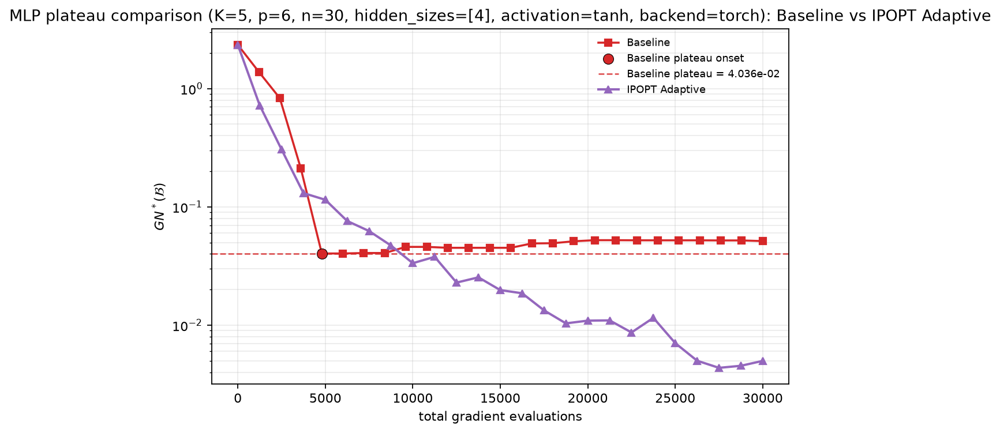
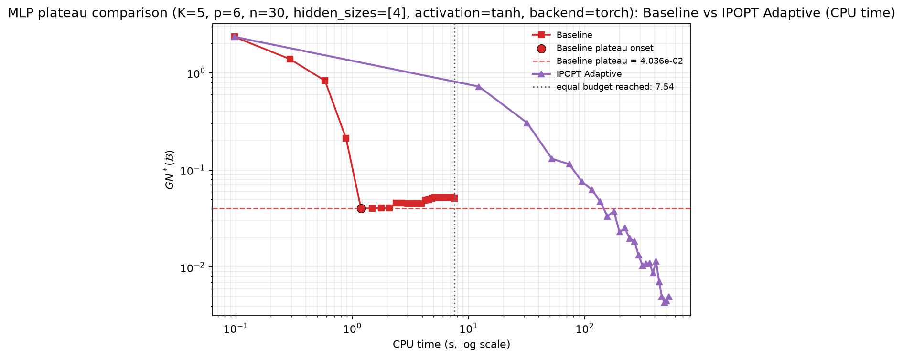

# K5_p6_n30_h4_tanh_r6_B30000

## Parameters

```json
{
  "K": 5,
  "p": 6,
  "n": 30,
  "hidden_sizes": [
    4
  ],
  "activation": "tanh",
  "coarse_resolution": 6,
  "n_passes": 100000,
  "steps_per_point_per_pass": 5,
  "max_grad_evals": 30000,
  "baseline_eval_every_n_grads": 1200,
  "adaptive_eval_every_n_grads": 1200,
  "max_outer": 1000000,
  "max_inner": 25,
  "lambda_max_starts": 64,
  "prune_inner": true
}
```

Parameter dimension d = 53; data seed = 7, init seed = 8.

## Why these parameters

Equal-budget design: both methods consume the same gradient budget on the
same problem instance and initial point; neither stops early on a target.

- `K` is the swept variable. The baseline's grid has C(r+K-1, K-1) nodes,
  so at fixed resolution r the same budget is split over rapidly more nodes
  as K grows, while each scalarised step also costs K oracle calls.
- `coarse_resolution=6` is held fixed across K so the sweep isolates the
  effect of K. It is small enough that the baseline finishes at least two
  full passes inside the budget at every K (reaching its plateau), and
  large enough that its plateau is not trivially coarse at K=3.
- `max_grad_evals=30000` gives both methods enough budget to expose their
  plateaus at every K in the sweep (verified: plateau found for both).
- `p=6, n=30, hidden=[4]` keep the oracle cheap: this experiment is about
  gradient-efficiency, so wall-clock cost is dominated by measurement, not
  by the oracle, and run times stay in minutes.
- `activation="tanh"`: the paper's analysis assumes L-smooth objectives.
  ReLU violates that assumption (gradient jumps at activation kinks force
  the descent safeguard into extreme step-size reductions that penalise
  only the adaptive method — observed L_scale_final up to 2^25 on ReLU
  runs of this very sweep), while tanh objectives are C-infinity and
  satisfy it. The paper's Section 5.1 leaves the activation free.
- `prune_inner=True` follows the paper's Section 5 implementation note
  (only the best inner candidate joins the bundle) and keeps the bundle
  small, so the per-checkpoint metric solve stays fast.
- `steps_per_point_per_pass=5` (baseline) and `max_inner=25` (adaptive)
  are the defaults used throughout the project's earlier runs.
- Checkpoint cadence 1/25 of the budget: ~25 checkpoints, comfortably above
  the plateau detector's minimum of window*consecutive_windows = 10.


## Results

| quantity | baseline | adaptive |
|---|---|---|
| final best-so-far GN* | 4.036e-02 | 4.356e-03 |
| plateau found | True | False |
| plateau level | 4.036e-02 | n/a |
| plateau onset (grad evals) | 4800 | None |
| CPU time to common target 4.036e-02 | 1.19 s | 156.94 s |
| grad evals to common target | 4800 | 10000 |

Plateau ratio (baseline / adaptive): **n/a**  
CPU-time ratio to common target (baseline / adaptive): **0.01**  
Gradient ratio to common target (baseline / adaptive): **0.48**  
(ratios > 1 mean the adaptive method is better)

## Health checks

- `L_scale_final` = 4.0 (>1 means the probe-estimated smoothness constants were raised at runtime by the descent safeguard; expected on ReLU MLPs)
- `inner_cap_hits` = 0 (budget mode: informational only)
- Runtime warnings during the run:

  - Descent-lemma check failed: the supplied smoothness constants L underestimate the objectives' curvature along the iterates. The step sizes are being reduced adaptively (L scaled up); the run continues, but the supplied L should not be trusted for theory constants.

## Plots




