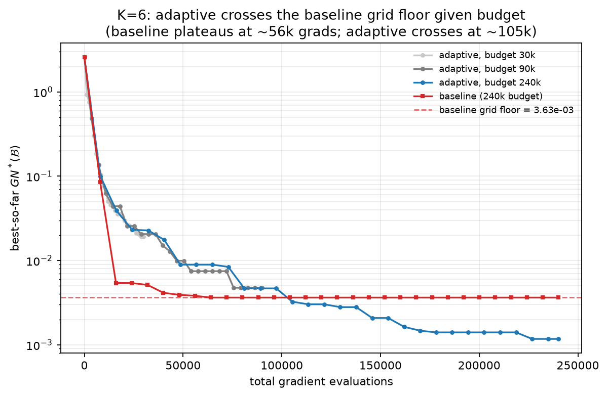

# 平台扫描——跨配置分析

K = 3, 4, 5, 6 的等预算(30,000 次梯度求值)一对一比较。
固定:p=6,n=30,hidden=[4],tanh 激活,网格分辨率 r=6,
prune_inner=True,max_inner=25,数据种子 7 / 初始化种子 8。
每个配置的参数、选择理由、图和健康标志见各自的 `K*/README.md`;
原始曲线在各自的 `summary.json`。

## 主要数字(共享预算耗尽时的历史最优 GN*)

| K | 基线最终 | 自适应最终 | 质量比 基线/自适应 | 基线平台 | 自适应平台 |
|---|---|---|---|---|---|
| 3 | 8.97e-03 | 1.72e-04 | **52.1** | 未到达 | 未到达 |
| 4 | 3.56e-02 | 2.84e-03 | **12.6** | 未到达 | 2.84e-03 |
| 5 | 4.04e-02 | 4.36e-03 | **9.3**  | 4.04e-02 | 未到达 |
| 6 | 4.77e-03 | 1.92e-02 | **0.25** | 未到达 | 未到达 |

("平台未到达" = 预算结束时历史最优曲线在每个检测窗口内的改进仍
超过 5%,`detect_plateau` 因此正确地拒绝宣布平台水平;两个水平都
存在时其比值就是平台比,否则上表的等预算质量比就是可比的汇总
统计量。)

**K=6 那一行是预算截断,不是失败。**在固定的 30k 预算下,自适应
方法还没降完;给更多预算它会越过基线并获胜(240k 时比值 3.09)。
见下文的预算研究。平台故事在本扫描的每个 K 上都成立;只是自适应
方法反超基线所需的预算随 K 增长。

健康标志:整个扫描中 `L_scale_final` 在 2 到 8 之间(下降保护机制
触发一到三次以纠正探针估计——属预期工作区);`inner_cap_hits` = 0;
每次运行有一条预期中的 RuntimeWarning(L 低估提示)。

## 与理论相符之处

在 K = 3, 4, 5,自适应方法在梯度轴上完全按论文预测占优(跨权重的
梯度复用加自适应分配):同样的梯度预算下 GN* 低一个数量级以上;
K=5 是教科书式图景——基线在 4.0e-02 进入平台,自适应方法仍在
继续下降、低一个数量级。

CPU 轴上基线在这里的每个 K 都赢(CPU 比值 0.006–0.16),这**同样**
是预测中的行为:n=30 使梯度几乎免费,自适应方法每轮的 λ 搜索开销
于是占主导。自适应方法的墙钟优势由交叉扫描论证(那里梯度昂贵);
本扫描隔离的是梯度效率。

## K=6 调查——从"异常"到"预算截断假象"

在 30k 的扫描预算下,自适应方法落在 1.9e-02,基线 4.8e-03
(种子 7)。随后做了两轮调查。第一轮(七个单预算变体)排除了所有
30k 预算内的解释;第二轮(预算升级)找到了真正的原因。两轮都保留
在此,因为推理过程本身有价值:单预算矩阵排除的东西是对的,而预算
研究正是用户从"仍在下降的曲线"读出的方向。

第一轮——七个变体,全部 30k、全部 K=6、tanh:

| 变体 | 相对参考的改动 | 基线最优 | 自适应最优 | 自适应更好? |
|---|---|---|---|---|
| A(参考) | — | 4.77e-03 | 1.92e-02 | 否 |
| B | 种子 17/18 | 7.56e-03 | 2.31e-02 | 否 |
| C | 种子 27/28 | 2.77e-02 | 1.66e-02 | **是** |
| D | max_inner 25→10 | 4.77e-03 | 1.95e-02 | 否 |
| E | prune_inner→False(束 5001 点) | 4.77e-03 | 1.67e-02 | 否 |
| F | w_true_scale 1→4(目标冲突更强),种子 7 | 3.16e-04 | 9.98e-04 | 否 |
| G | w_true_scale 1→4,种子 17 | 3.92e-03 | 1.15e-02 | 否 |

矩阵给出的结论:

1. **不是步长病态。**每个变体的 `L_scale_final` 都保持在 4–16
   (ReLU 时代的步长塌缩已不存在),自适应曲线一路平滑下降——
   它是慢,不是坏。
2. **不是剪枝/解集合大小的问题。**保留所有迭代点(变体 E,
   5,001 点)只让自适应结果好约 13%。
3. **不是"利用对搜索"的平衡问题。**λ 重搜频率提高 2.5 倍
   (变体 D)没有任何改变。
4. **依赖实例,平均而言不利。**三个种子里赢一个;变体 A–E 中
   自适应的最终水平稳定在约 2e-02,而基线在 4.8e-03–2.8e-02
   之间波动。
5. **加强目标间冲突也救不回来。**w_true_scale=4 时(变体 F、G——
   类别更可分、按类目标冲突更强)两种方法的绝对水平都低得多,
   但比值仍约 0.3:粗网格仍未受到惩罚。

第一轮正确确立的:在**固定的** 30k 预算下,没有任何种子、剪枝
设置、内层日程或冲突强度能翻转 K=6。它错误推断的:据此认为 K=6
是永久失败("粗网格不受惩罚;优势不随 K 增长")。这个推断犯了
经典错误——固定预算不动、只变其他一切,恰恰漏掉了用户指出的那
一根轴。

第二轮——预算升级(用户提出的假设)。K=6 的曲线
(`gn_vs_grad_evals.png` 里基线走平、自适应仍在下降)提示 30k 的
比值是在自适应方法收敛之前读取的。其他一切固定、只加预算:

| 预算 | 基线最终(历史最优) | 自适应最终 | 比值 基线/自适应 | 备注 |
|---|---|---|---|---|
| 30k  | 4.77e-03 | 1.92e-02 | 0.25 | 扫描配置——自适应更差 |
| 90k  | 3.55e-03 | 4.74e-03 | 0.75 | 基线在 54k 梯度处进入平台;自适应仍在下降 |
| 240k | 3.63e-03 | 1.17e-03 | **3.09** | **自适应穿越到下方并获胜** |

**定论:K=6 在 30k 下的结果是预算截断假象。**基线很早就到达其
网格地板(约 3.6e-03,每个预算下都从约 56k 梯度起固定不动),
此后再无改进。自适应方法全程单调下降——在约 105k 梯度处越过基线
的地板,到 240k 时达到 1.17e-03,3.09 倍的优势且仍在缓慢下台阶。
30k 时自适应方法只下到了全程的约三分之一,等预算比较是在它收敛
之前读取的。三个预算的轨迹(比值 0.25 → 0.75 → 3.09)一锤定音。

修正后的结论:**平台故事在 K=6 同样成立,只是需要更多梯度才能
显现。**基线在每个 K 都有结构性网格地板(均匀离散化不可能好过
它的覆盖半径);自适应方法没有这种地板、持续下降,但 K 越大收敛
越慢(与论文定理 2 一致——自适应方法的外层迭代界同样对 K 指数)。
所以自适应方法反超基线所需的预算随 K **增长**:K=3 几乎立即,
K=4–5 在 30k 之内,K=6 约 105k。固定 30k 预算下看起来的
"优势在 K=6 消失",实际上是"反超预算随 K 增长"。上面七个单预算
诊断变体都正确地表明:没有任何 30k 预算内的旋钮(种子、剪枝、
内层日程、冲突强度)能翻转 K=6——缺失的维度是预算本身,而这是
用户从 `gn_vs_grad_evals.png` 里仍在下降的自适应曲线中识别出来的。

## 诚实报告说明

- 所有数字都是 NP 难的对 λ 最大化问题的启发式下界,由同一把固定的
  256 起点 IPOPT 尺子对两种方法计算。
- 除 K=6(三个种子,见上)外每个配置只有一个问题实例;单个 K 的
  比值应视为单实例测量,跨 K 的模式才是结论。
- 不利的 K=6 结果被完整报告,包括趋势图。
