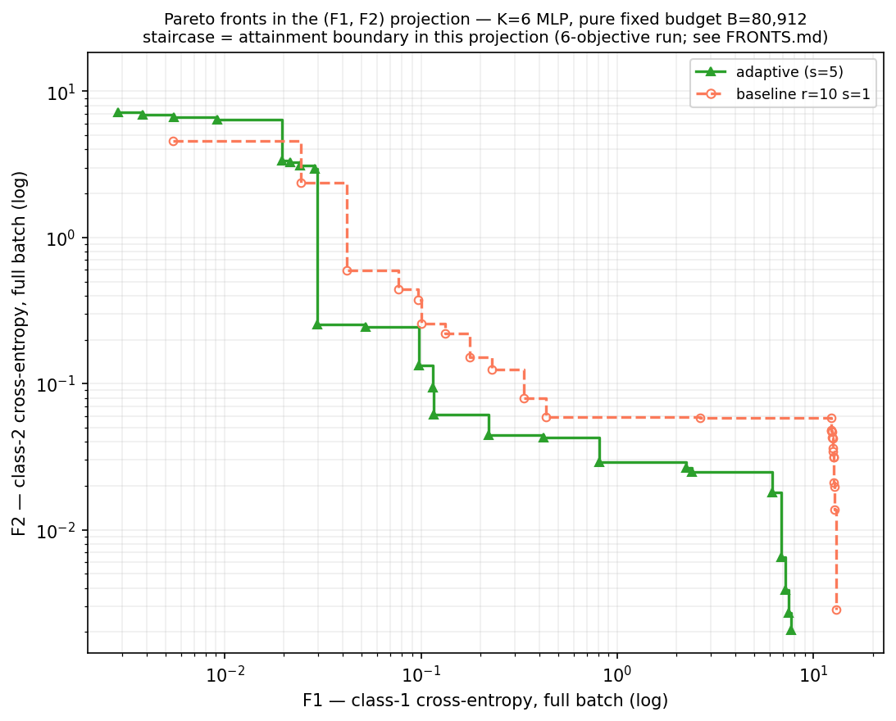
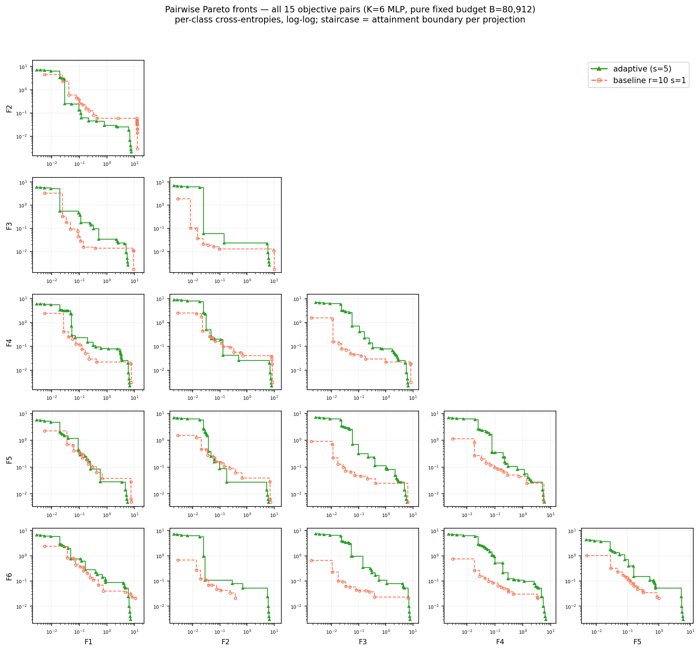

# K=6 纯固定预算前沿实验报告：F1–F2 与全部 pairwise 投影

## 结论先行：两张图有没有画错

两张 PNG 的核心数据和绘图实现没有画错。独立从 `adaptive_s5/grams.npz` 和 `baseline_r10_s1/grams.npz` 的 full-batch `fvals` 重新进行二维非支配筛选后，得到的每条 front 点数以及两个方法合并后的 joint-front 贡献数，均与 `front_metrics.json` 一致：

- F1–F2 单图：adaptive 内部 front 23 点，baseline r=10 s=1 内部 front 26 点；把两者放在一起重新筛选后，joint front 中 adaptive 贡献 20 点、baseline 贡献 2 点。
- Pairwise 图：下三角恰好覆盖 \(\binom{6}{2}=15\) 个目标对；15 个 panel 的 joint-front 贡献数全部通过独立二维扫描复核。
- 横纵轴均为正的 full-batch per-class cross-entropy，使用 log-log 坐标合理。
- `steps-post` staircase 的方向正确：它表示已交付点在该二维投影中的 attainment boundary，不是把两个离散可行点之间的直线误当成可达到点。

但是必须同时披露四个语义限制：

1. 两张图只画了 7 个 leg 中的两个：adaptive s=5 和 baseline r=10 s=1。其他五个 baseline leg 被有意省略，以免 panel 无法阅读。因此它们不是完整 baseline sweep 的可视化。
2. 每个 panel 都从该 leg 的全部 delivered points 中，仅取相应两个坐标并重新做二维 nondominated filtering。这是“该目标对的二维 attainment front”，不是“六维 nondominated front 投影到二维”。其余四个目标在 panel 中完全不受约束。
3. marker 才是实际发现的非支配点；横向和纵向 staircase segment 是被这些点支配的区域边界，不代表中间存在实际模型。
4. 没有 ground-truth Pareto front。图中只比较两个方法在本次运行中发现的经验前沿。

现有 `FRONTS.md` 中“F1–F2 两个方法持有 8 vs 9 个 joint corner”的一句话是旧数字；最新 JSON 和独立复核均为 **adaptive 20、baseline 2**。该旧文字不影响 PNG 的生成，但不应在报告中引用。

## 1. 参数选择

### 1.1 共同问题与优化参数

| 类别 | 参数 | 取值 | 选择与作用 |
|---|---|---:|---|
| 问题 | 目标数 \(K\) | 6 | 六个 per-class objectives；权重位于 5 维单纯形，适合检验固定网格的组合覆盖成本 |
| 数据 | 输入维度 \(p\) | 20 | 与该 MLP 实验族保持一致 |
| 数据 | 样本数 \(n\) | 50,000 | 使 full-batch 与 minibatch 成本差异具有代表性 |
| 模型 | 隐藏层 | [96, 96] | 两层 tanh MLP |
| 模型 | 参数数 \(d\) | 11,910 | 包含两层隐藏层和 6 维输出层参数 |
| 目标 | \(F_1,\ldots,F_6\) | 六个 per-class full-batch cross-entropy | 所有目标均最小化 |
| 随机种子 | data / init / sampler | 7 / 8 / 41 | 所有 leg 共用数据和初始点 |
| 固定预算 | \(B\) | 80,912 grad-equivalents | 所有 leg 使用同一预算；该值沿用先前 r=15、tol=0.02 leg 的实现成本，便于同预算比较 |
| 停止规则 | stop | budget exhaustion | 不输入 epsilon、node tolerance、solve target 或 relative target |
| work unit | 一个 segment | 13 个 Momentum-SVRG minibatch steps + 1 次 full joint evaluation | 所有方法使用完全相同的工作单元；endpoint 加入 delivered set |
| minibatch | batch size | 4096 | 分层 stochastic scalarized-gradient oracle |
| Momentum-SVRG | epoch length | 13 | \(\lceil 50000/4096\rceil\) |
| Momentum-SVRG | step constant / momentum | 0.1 / 0.5 | 所有方法共用 |
| warm start | 规则 | single chain | 每个 segment 从上一个 delivered endpoint 继续，方法间保持一致 |
| baseline policy | 下一权重 | uniform simplex grid 的 snake 顺序 | 测试固定菜单在 K=6 下的覆盖能力 |
| adaptive policy | 下一权重 | strict IPOPT worst-lambda search | 每次从当前 Gram stack 中寻找最坏权重；targeting cap=24 |
| adaptive | \(s\) | 5 | 每次权重决策后连续运行 5 个 segment，降低频繁搜索开销 |
| baseline 主设置 | \(s\) | 5 | 与 adaptive 共享 allocation chunk |
| baseline 敏感性 | \(s\) | 1 | 检验更细交错是否能缓解 K=6 网格覆盖不足；决策本身近乎免费 |
| front 数据 | delivered set | 每个 segment endpoint + \(x_0\) | 每个点保存六维 full-batch objective vector |
| 投影 front | 定义 | 每个目标对独立做二维 nondominated filtering | 表示 pairwise attainment，不约束其余四个目标 |
| 坐标 | scale | log-log | loss 从约 \(10^{-3}\) 到 \(10^1\)，线性坐标会压缩主要结构 |
| central metrics | central bound | 所有六个 loss \(\le1\) | 排除 above-\(x_0\) wandering 和 specialist tails |
| HV | Monte Carlo | 100,000 samples，seed 20260730 | 在 central box 中用所有 leg 的共同样本估计 paired HV |
| GN audit | final meter | strict 64-start search | 仅为 GN 的搜索下界，不参与这两张 objective-value 图，也不是 K=6 的 epsilon 证书 |

### 1.2 实际运行的 leg 与网格覆盖

K=6 时，分辨率为 r 的均匀 simplex grid 有 \(\binom{r+5}{5}\) 个节点。固定预算下，大多数 s=5 baseline 无法完成第一遍网格。

| leg | r | s | 完整网格节点数 | 实际访问的不同权重 | 实际预算 | 是否画在两张投影图中 |
|---|---:|---:|---:|---:|---:|---|
| adaptive | — | 5 | 连续权重域 | 862 | 80,902.2 | 是 |
| baseline r=10 s=1 | 10 | 1 | 3,003 | 3,003 | 80,894.6 | 是 |
| baseline r=10 s=5 | 10 | 5 | 3,003 | 1,180 | 80,897.7 | 否 |
| baseline r=12 s=5 | 12 | 5 | 6,188 | 1,165 | 80,898.4 | 否 |
| baseline r=15 s=1 | 15 | 1 | 15,504 | 5,431 | 80,893.7 | 否 |
| baseline r=15 s=5 | 15 | 5 | 15,504 | 1,170 | 80,906.6 | 否 |
| baseline r=20 s=5 | 20 | 5 | 53,130 | 1,181 | 80,897.6 | 否 |

图中选择 adaptive 和 r=10 s=1，是因为它们是这组运行中仅有的两个 full-coverage leg：adaptive 对所有类别都取得较低 loss，而 r=10 s=1 完成了整个 3,003-node 网格。其他 leg 在一个或多个目标上存在明显覆盖空洞，加入 pairwise matrix 会显著增加视觉拥挤。

## 2. 图一：F1–F2 投影结果与分析

### 2.1 结果

在 F1–F2 这一个目标对上，adaptive 明显占优：

- adaptive 的二维内部 front 有 23 个实际点；baseline r=10 s=1 有 26 个。
- 点数更多不等于更好。把两个内部 front 合并后重新筛选，22 个 joint-front 点中 adaptive 贡献 20 个，baseline 只贡献 2 个。
- adaptive 达到的单目标最小值也更低：\(F_1^{\min}=0.00286\)、\(F_2^{\min}=0.00205\)；baseline 分别为 0.00546 和 0.00284。

baseline 保留下来的两个 joint-front 点约为：

\[
(F_1,F_2)=(0.00546,4.55),\qquad(0.02451,2.36).
\]

它们位于图的左上段：baseline 在相近区域用稍大的 F1 换到了更小的 F2，因此没有被 adaptive 严格支配。进入 \(F_1\approx0.03\) 以后，adaptive 的 F2 从约 3 快速降到 0.25，并在中间和右下区域形成绝大部分 joint attainment boundary。右端 adaptive 最终达到约 \((7.66,0.00205)\)，F2 端点也优于 baseline。

### 2.2 staircase 应如何阅读

由于两个目标都最小化，越靠左下越好。绿色实线大部分位于橙色虚线的左下方，表示在相同 F1 上 adaptive 通常能取得更小的 F2，或在相同 F2 上取得更小的 F1。

横向 staircase 表示：某个已发现点的 F1 已经不大于这一段的横坐标，而其 F2 保持为对应 marker 的值；竖向段表示 attainment boundary 在下一个实际 marker 处下降。只有三角形和空心圆是实际模型，阶梯中间不是新的可行模型。

### 2.3 为什么 adaptive 在 F1–F2 上优势明显

adaptive 每轮寻找当前六目标 GN 的最坏权重，不受固定网格遍历顺序约束，因此能在预算内反复修补未覆盖类别。r=10 s=1 虽然最终遍历了完整网格，但一个 K=6、r=10 网格已有 3,003 个节点，80,912 预算只够约 1.85 遍；分给每个 scalarization 的训练深度有限。adaptive 只作 862 次连续权重决策，却可以把工作集中在真正形成 coverage bottleneck 的区域，因此在 F1、F2 两个类别上同时形成更低的 attainment boundary。

## 3. 图二：15 个 pairwise 投影结果与分析

### 3.1 图的布局

矩阵只使用下三角：

- 第一行：F1–F2；
- 第二行：F1–F3、F2–F3；
- 第三行：F1–F4、F2–F4、F3–F4；
- 依此类推，最后一行是 F1–F6 至 F5–F6。

右上空白区域不是漏图，而是去掉 \((F_i,F_j)\) 与 \((F_j,F_i)\) 的重复后留下的布局空间。

### 3.2 两个方法在各 pair 的 joint-front 贡献

下表把两个方法各自的二维 front 再合并筛选；数字表示该方法在相应 pair 的 joint nondominated front 中贡献多少个实际 marker。

| objective pair | adaptive | baseline r=10 s=1 | 更多 joint corners |
|---|---:|---:|---|
| F1–F2 | **20** | 2 | adaptive |
| F1–F3 | 7 | **10** | baseline |
| F2–F3 | 6 | **9** | baseline |
| F1–F4 | 7 | **10** | baseline |
| F2–F4 | **11** | 7 | adaptive |
| F3–F4 | 5 | **11** | baseline |
| F1–F5 | **15** | 9 | adaptive |
| F2–F5 | **11** | 6 | adaptive |
| F3–F5 | 4 | **11** | baseline |
| F4–F5 | 6 | **14** | baseline |
| F1–F6 | 9 | **13** | baseline |
| F2–F6 | 7 | **9** | baseline |
| F3–F6 | 4 | **12** | baseline |
| F4–F6 | 6 | **14** | baseline |
| F5–F6 | 5 | **17** | baseline |

adaptive 在 4/15 个 pair 中贡献更多 joint corners，baseline 在 11/15 个 pair 中贡献更多。但是“贡献点数更多”不能直接解释为该方法在六目标意义下更好，原因有三点：

1. baseline 交付点更多：5,558 个，而 adaptive 为 4,309 个；更密的轨迹本身就可能产生更多二维转折点。
2. 每个 pair 都忽略另外四个目标。一个 baseline point 可以在 F3–F6 中某一对上成为二维 specialist，同时在 F1、F2 或其他类别上很差。
3. point count 不衡量每个方法支配区域的大小，也不衡量距离真正六维参考前沿的距离。

因此，pairwise matrix 的正确结论是“两个方法在不同类别对上各有局部优势，baseline 产生更多 pair-specific specialist corners，而 adaptive 在 F1–F2、F2–F4、F1–F5、F2–F5 上形成更强的二维 attainment boundary”，不能据此宣布 baseline 的完整六目标 front 更好。

### 3.3 为什么 pairwise 图看起来比六维指标更偏向 baseline

六维 central 指标给出相反且更完整的 coverage 结论：

| 方法 | 6-D central front 点数 | central IGD ↓ | central max-distance ↓ | central HV ↑ |
|---|---:|---:|---:|---:|
| adaptive s=5 | **215** | **0.0420** | **0.4198** | **0.0293 ± 0.0010** |
| baseline r=10 s=1 | 35 | 0.3302 | 0.6503 | 0.0270 ± 0.0010 |

adaptive 的 central IGD 约为 baseline 的 \(0.0420/0.3302\approx0.127\)，即覆盖距离约好 7.9 倍；HV 只略高，说明两者总体支配体积接近，但 adaptive 对六维 central union front 的覆盖密度明显更好。

pairwise 投影会压缩这一优势：当四个未画目标被删除后，baseline 在某两个类别上的 specialist point 仍可以留在二维 front，而它在其余类别上的缺陷完全不可见。换言之，pairwise 图适合诊断“哪一对类别由谁覆盖”，六维 IGD/HV 才更接近“六个类别同时表现如何”。

## 4. 整体结论

1. **制图本身正确。** 两张图均从同一固定预算下的 full-batch objective values 生成；二维非支配筛选、log 坐标、15-pair 布局和 staircase 方向均通过独立复核。
2. **F1–F2 上 adaptive 明显更好。** 两方法 joint front 的 22 个点中，adaptive 贡献 20 个，且取得更低的 F1、F2 单目标最小值。
3. **全部 pairwise 结果是 mixed。** adaptive 在 4 个 pair 中贡献更多 joint corners，baseline 在 11 个 pair 中更多；这说明 baseline 有丰富的 pair-specific specialist trajectories，不等价于六维整体覆盖更好。
4. **完整六目标结论仍然支持 adaptive。** adaptive 的 central IGD 比 r=10 s=1 低约 7.9 倍，central front 点数为 215 vs 35，HV 也略高；其优势主要是更均衡、密集地覆盖六维 genuine trade-off region。
5. **不要把二维投影当成 ground truth。** 两张图没有显示真实 Pareto front，也没有约束未画出的四个目标；它们是 final-budget、single-realization 的经验 attainment diagnostics。
6. **其他 baseline leg 未出现在图中。** 若报告声称比较了完整 r/s sweep，必须同时给出表格或六维指标；仅凭这两张投影图只能比较 adaptive s=5 与 baseline r=10 s=1。

最终建议在报告中使用以下一句主结论：

> 在相同 \(B=80{,}912\) 梯度等价预算下，adaptive policy 在 F1–F2 投影中形成了明显更优的 attainment boundary；全部 15 个 pairwise 投影显示 baseline 仍能产生较多 pair-specific specialist corners，但这些二维局部优势无法转化为六目标联合覆盖。结合 central IGD、max-distance 和 HV，adaptive 对六维 genuine trade-off region 的整体覆盖更完整。

