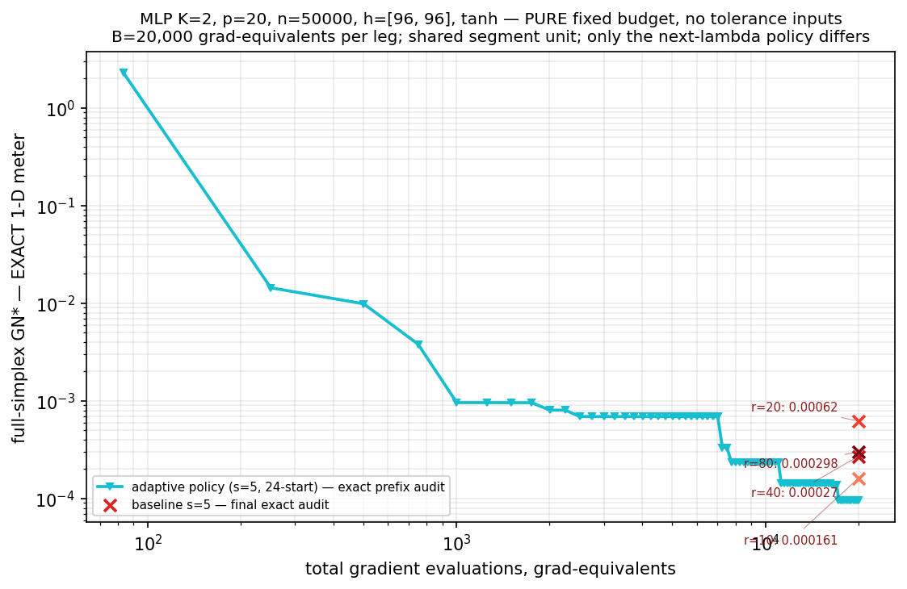
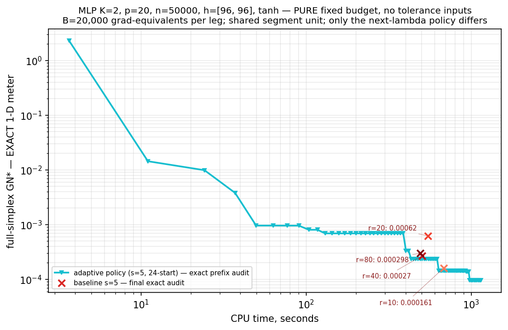
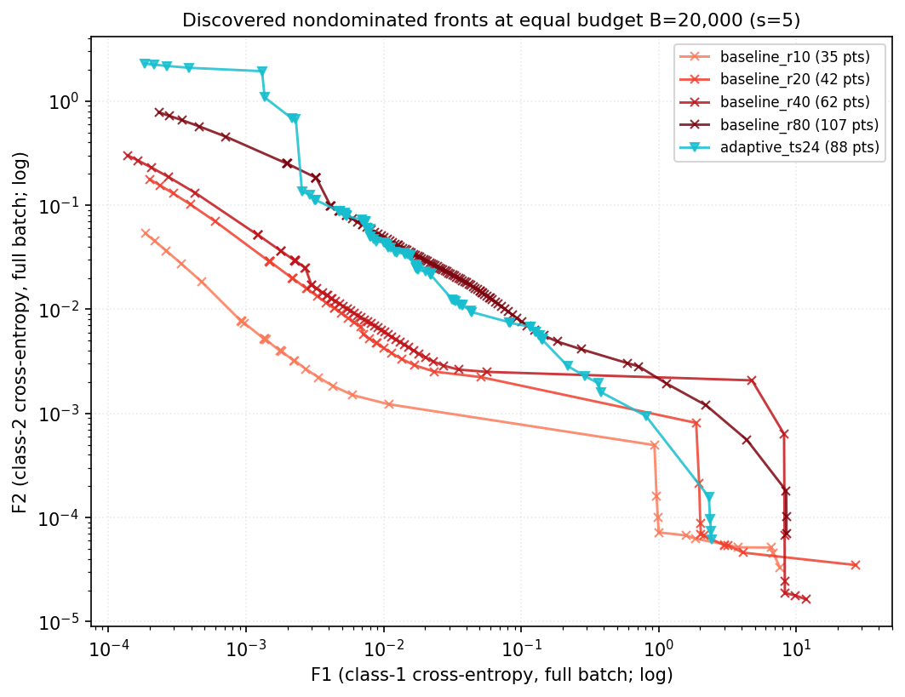

# K=2 纯固定预算实验报告

## 摘要

本实验在同一个两目标非凸 MLP 问题上，以相同的梯度等价预算比较 uniform-discretization baseline 与 adaptive bundle policy。实验控制了优化器、单段工作量、链式 warm start、批大小和停止规则，方法之间唯一有意改变的变量是“下一段使用哪个权重 \(\lambda\)”。

主要结果是：adaptive 在最终 stationarity coverage 指标上最好，最终审计值为 \(9.52\times10^{-5}\)，相对最佳 baseline r=10 的 \(1.61\times10^{-4}\) 改善约 40.8%，或等价地好 1.69 倍；但是 adaptive 完成相同预算需要 1093–1141 秒，所有 baseline 只需要 490–680 秒。因此，adaptive 的优势是“相同时间/预算下更快降低 GN”的 anytime quality 优势，而不是“完成固定预算所需总时间更短”。

目标值空间中的结论不同：baseline r=10 给出了更深的经验 value front，adaptive 的大部分前沿点会被其他方法的点支配。这不与 GN 结果矛盾，因为 GN 衡量的是加权梯度平稳性覆盖，不直接优化目标函数值、前沿间距或超体积；在非凸 MLP 中，小梯度也可能对应较差的局部平稳点。

两张图的原始数值没有发现画错，但存在需要修正的展示口径：图 1 的“CPU time”实际是单次 wall-clock elapsed time；图 2 画的是每个方法各自的非支配集，不是所有方法合并后仍然非支配的全局经验前沿；24-start 和 64-start 标签表示上限，而 K=2 时实际每轮只有 6 个（首轮）或 7 个（后续轮）结构化起点。

## 1. 实验目的

实验回答两个彼此相关但不等价的问题：

1. 在相同梯度等价预算下，自适应选择当前最难权重的策略，能否比固定均匀网格更快覆盖整个权重单纯形上的一阶平稳性？
2. 两种策略在训练过程中发现的目标值点，能否形成质量高、覆盖广且分布均匀的经验 Pareto 前沿？

第一个问题使用

\[
GN^*(\mathcal B)=\max_{w\in[0,1]}\min_{x_i\in\mathcal B}
\left\|J_F(x_i)^T(w,1-w)\right\|^2
\]

衡量。数值越小，表示对每个 trade-off weight，都能在已交付点集中找到一个加权梯度范数较小的点。由于 K=2，每个点对该指标的贡献是关于 \(w\) 的凸二次函数，因此可以进行一维稠密扫描、局部交点 polish，并给出严格的上下界区间 \([V,U]\)。图中的轨迹使用真实函数值下界 \(V\)，正面的 epsilon 证书应使用上界 \(U\)。

第二个问题直接使用每个 segment 末尾 full-batch 计算得到的 \((F_1,F_2)\)，对每个方法分别做二维非支配筛选。该指标描述 objective-value front，与 GN 的 stationarity front 含义不同。

## 2. 实验思路与公平性设计

### 2.1 控制变量

每个 leg 都从同一数据、同一初始化出发，使用相同的 Momentum-SVRG segment、相同的 \(s=5\)、相同 chain warm start 和相同预算停止规则。每个分配决策之后连续运行 5 个 segment。两类方法唯一的策略差异是：

- baseline：在分辨率为 r 的均匀权重网格上按 snake 顺序循环；K=2 时分别有 r+1 个节点。
- adaptive：根据当前已交付点的 Gram 集合，用 IPOPT 搜索使当前 GN 最大的最坏权重，再在该权重上继续训练。

因此，这个设计适合隔离“固定菜单轮询”与“根据当前最坏区域自适应调度”的差异。

### 2.2 固定预算与成本口径

每个 leg 的预算均为 20,000 grad-equivalents。一轮 full joint evaluation 计 K=2 个等价梯度；minibatch SVRG 的样本梯度按 IFO 数换算。一个满支撑 segment 包含 13 个 minibatch steps 和一次 full joint evaluation，上界成本约为

\[
13\times\frac{2\times4096\times2}{50000}+2\approx6.26.
\]

baseline 在 \(w=0\) 或 \(w=1\) 时只使用一个类别的 minibatch，因此这些 segment 实际更便宜，也就能在同一预算内完成略多的 segment。adaptive 几乎总是选择内部权重，通常支付满支撑成本。

### 2.3 测量口径

- GN 审计在优化结束后从保存的 Gram 矩阵重算，审计时间不计入横轴。
- adaptive 的最坏权重搜索是算法内部工作，计入 wall-clock 横轴。
- 计时从初始点完成之后开始，不包括数据/模型构建和初始 joint evaluation。
- Pareto 图使用同一最终预算下所有 segment endpoint 的 full-batch \((F_1,F_2)\)。

## 3. 参数选择

| 类别 | 参数 | 取值 | 选择理由 |
|---|---|---:|---|
| 问题 | 目标数 K | 2 | 权重单纯形退化为一维，GN 可做带证书的一维审计，且前沿可直接绘制 |
| 问题 | 输入维度 p | 20 | 与同一 MLP 实验族保持一致 |
| 问题 | 样本数 n | 50,000 | 使 full-gradient 成本足够明显，测试 stochastic segment 的实际效率 |
| 模型 | 隐藏层 | [96, 96] | 两层 tanh MLP；总参数数 d=11,522 |
| 模型 | 激活函数 | tanh | 与本实验族预设一致，产生平滑非凸目标 |
| 目标 | 损失 | 两个 per-class full-batch cross-entropy | 分别构成 \(F_1,F_2\) |
| 数据 | planted 权重尺度 | 1.0 | 复用 planted linear-softmax 数据生成设定 |
| 随机性 | data / init / sampler seed | 7 / 8 / 41 | 所有 leg 共用数据和初始化；采样序列可复现 |
| 总预算 | B | 20,000 grad-equivalents | pilot 固定预算；足以运行约 3,200–3,400 个 segment |
| baseline | r | 10, 20, 40, 80 | 对应 11、21、41、81 个权重节点，覆盖从粗网格到细网格 |
| adaptive | decision mode | strict IPOPT search | 与 K=6 adaptive 机制保持一致 |
| adaptive | targeting-start cap | 24 和 64 | 敏感性对照；K=2 的结构化起点集合实际只有首轮 6 个、后续 7 个，因此两者轨迹完全相同 |
| 共同参数 | 每次决策的 segment 数 s | 5 | 降低 adaptive 频繁搜索的开销，并与 pilot 设计一致 |
| Momentum-SVRG | batch size | 4096 | stochastic oracle 的总分层 minibatch 大小 |
| Momentum-SVRG | epoch length | 13 | \(\lceil 50000/4096\rceil\) |
| Momentum-SVRG | step constant | 0.1 | 实际步长为 \(0.1/(L_\lambda L_{scale})\) |
| Momentum-SVRG | momentum | 0.5 | 所有方法共用 |
| safeguard | 最大重试数 | 4 | 发生 scalarized loss 上升时增大 \(L_{scale}\) 并重试 |
| 记录 | eval every | 250 grad-equivalents | 约每 250 个等价梯度记录一次前缀 |
| GN 审计 | audit grid | 200,001 | 一维扫描加 active-pair crossing polish，并计算严格上界 |
| central front | central bound | \(F_1,F_2\le1\) | 排除极端 specialist tails 后另报 central metrics |

## 4. 实验结果与分析

### 4.1 最终结果汇总

| leg | segments | 不同权重数 | wall-clock (s) | 其中决策时间 (s) | GN 审计值 V | 证书上界 U | front 点数 |
|---|---:|---:|---:|---:|---:|---:|---:|
| baseline r=10 | 3,404 | 11 | 680.3 | 0.0 | 1.6071e-4 | 1.6072e-4 | 35 |
| baseline r=20 | 3,302 | 21 | 546.8 | 0.0 | 6.2015e-4 | 6.2024e-4 | 42 |
| baseline r=40 | 3,247 | 41 | 504.3 | 0.0 | 2.7010e-4 | 2.7018e-4 | 62 |
| baseline r=80 | 3,220 | 81 | 490.1 | 0.0 | 2.9811e-4 | 2.9829e-4 | 107 |
| adaptive cap=24 | 3,194 | 617 | 1,140.7 | 568.0 | **9.5186e-5** | **9.5286e-5** | 88 |
| adaptive cap=64 | 3,194 | 617 | 1,093.3 | 566.2 | **9.5186e-5** | **9.5286e-5** | 88 |

adaptive cap=24 与 cap=64 的 `gram_stack`、`fvals`、`lam_history` 和 segment 记录逐元素完全相同；二者不是两条独立算法轨迹，只是相同轨迹在两次 wall-clock 运行中的计时重复。47 秒的总时间差应视为系统计时波动，而不是 64-start 更快。

### 4.2 GN 与梯度预算

在相同的 20,000 grad-equivalents 下，adaptive 的最终 GN 为 \(9.52\times10^{-5}\)，相对最佳 baseline r=10 的 \(1.61\times10^{-4}\) 改善 40.8%。原因是 adaptive 每次直接寻找当前 GN 的最坏权重，把训练集中到尚未被 bundle 覆盖的窄区域；baseline 必须循环访问整个固定网格，其中很多已覆盖节点仍继续得到预算。

baseline 随 r 并不单调：r=10 优于 r=20、40、80。该问题最终的困难权重位于接近顶点的窄区域，最终 \(w^*\) 大约落在 0.01–0.03 或其镜像附近。某个网格是否正好落进该区域，以及固定预算在多少节点间分摊，比“r 越大越好”更重要。r=10 节点少，每个节点得到更深的重复优化；r=20 在 0 和 0.05 之间没有内部节点，表现反而最差。

因此，K=2 只意味着 baseline 网格不发生组合爆炸、adaptive 的权重搜索维度低；它并不保证固定网格调度在梯度利用率上最优。

### 4.3 GN 与 wall-clock

这里需要区分两种“CPU 优势”：

- 完成整个固定预算：adaptive 没有优势。cap=64 需要 1093 秒，baseline 只需 490–680 秒；adaptive 慢 1.61–2.23 倍。其 566 秒、约 51.8% 的时间花在最坏权重搜索上。
- 达到某个 GN 水平：adaptive 在中后段有明显 anytime 优势。adaptive 首次达到 \(GN\le10^{-3}\) 约需 47.5–49.8 秒；四个 baseline 中最快的 r=80 约需 182.1 秒。到 r=10 完成的 680 秒附近，adaptive 已达到 \(1.42\times10^{-4}\)，略好于 r=10 的最终 \(1.61\times10^{-4}\)。

早期并非全程由 adaptive 占优：约 15–30 秒时，r=10/r=20 的已记录 GN 小于 adaptive；adaptive 大约从 50 秒后开始显出持续优势，r=80 在约 300 秒附近也曾与它近似持平。图中连接线只是相邻 checkpoint 之间的视觉连接，不应当当作未测时刻的精确插值。

出现中后期 anytime 优势的原因是，adaptive 的定向调度节省了大量无效训练，节省的 oracle 工作超过了 K=2 下仍然存在的 IPOPT 搜索开销。但这一结论目前只有每个 leg 一次 wall-clock 记录；若作为论文中的 CPU 结论，必须进行多次独立计时、随机化运行顺序并报告 median/IQR。

### 4.4 目标值空间中的经验非支配前沿

图中 adaptive 看起来不如部分 baseline，这一现象在原始数据中确实存在，并非筛选画反。把 cap=24/64 的重复轨迹只计一次后，所有方法合并得到的 raw empirical union front 共 45 个点，其中 baseline r=10 贡献 34 个，r=20 贡献 3 个，r=40 贡献 6 个，r=80 贡献 0 个，adaptive 只贡献 2 个。限制到 \(F_1,F_2\le1\) 的 central union front 后，30 个点中 r=10 贡献 27 个，adaptive 只贡献 1 个。

造成该现象的主要原因有四个：

1. **优化指标不一致。** adaptive 选择使加权梯度范数最坏的权重，目标是 stationarity coverage；它没有直接最小化 IGD、最大化 hypervolume 或维持 value-front 的均匀间距。
2. **非凸局部平稳点。** 较小的梯度并不保证较小的交叉熵。adaptive 可以很快找到覆盖各权重的平稳点，但这些点在目标值上仍会被另一条训练轨迹支配。
3. **固定单链的路径依赖。** 两种方法都从上一 segment endpoint 继续。baseline r=10 只在 11 个权重间循环，每个权重反复得到较深训练；adaptive 不规则地切换到当前最坏权重，每个决策只连续运行 5 段，没有为每个权重维护独立 warm start，容易得到覆盖好但 value depth 不够的点。
4. **问题实例几乎不冲突。** 两个 per-class loss 可以同时被压到很小，真正的 trade-off knee 接近原点。baseline 的顶点权重会反复专门训练一个类别，制造“一边接近 0、另一边很大”的 specialist tails。这些点按 Pareto 定义可能仍然非支配，但并不代表中间 trade-off 更有用，也会严重影响 raw IGD。

量化结果也说明“adaptive 全面不好”过于简单。central IGD 中 r=10 最好，为 0.0195，adaptive 为 0.0431，r=80 为 0.0454；但 adaptive 的 central max-distance 为 0.1784，是所有方法中最小，表示它的最坏覆盖缺口反而最好。central HV 全部集中在 0.993–0.999，区分度很弱，说明本实例不适合用 HV 得出强结论。

## 5. 两张图是否画错

结论是“核心数值正确，但部分标题和语义容易误读”。

### 图 1

- `ck_cpu`、`audited_gn_history` 与原始 summary 对齐，没有发现点取错或预算不等。
- 横轴代码使用 `time.time() - t0`，严格说是 elapsed wall-clock，不是 process CPU time；应改名为 **wall-clock time (s)**。
- adaptive 决策时间已正确计入横轴，post-hoc GN audit 对所有方法均排除在横轴之外。
- 24-start/64-start 实际是 `max_starts` 上限。K=2 的 structured set 最多只有 7 个起点，图例不应让读者以为每轮真的执行了 24/64 次不同起点求解。
- 两条 adaptive 曲线数据完全重合，不应作为两次独立成功重复来解释。
- 图中 GN 轨迹画的是证书区间下界 V；如要写“\(GN^*\le\epsilon\)”应使用上界 U，或将纵轴写成“certified 1-D audit value V”。本实验最终 V–U 差约为 \(10^{-7}\)，不影响排名。
- 当前 runner 的最新版图只画 adaptive 轨迹和 baseline 最终点；用户提供的全 baseline 轨迹图是同一原始 summary 的另一种 replot。两种画法数值上都成立，但报告中必须说明所展示的是轨迹还是仅最终点。

### 图 2

- `_nondominated` 的二维最小化筛选逻辑正确，使用的 `fvals` 也是每个 segment endpoint 的 full-batch objective values。
- 图中每条线是“该方法内部的 nondominated discovered set”。很多点在合并所有方法后会被其他方法支配，因此标题若被理解成“全局 Pareto 最优”会误导。建议改为 **Per-method nondominated discovered sets**，并叠加一条 union nondominated front。
- log-log 坐标适合显示 \(10^{-5}\) 到几十的跨度，但图上的视觉距离与当前 raw-value Euclidean IGD 的度量空间不同；报告必须同时注明。
- adaptive cap=24/64 的两条线完全相同，重叠显示只用于证明敏感性结果一致，不代表两套不同的前沿。

## 6. 整体结论

1. 这个 pilot 支持 adaptive 调度对 **一阶平稳性覆盖** 有效：在相同梯度预算下，它得到最小的 certified GN，并以更少的 gradient-equivalents 达到 \(10^{-3}\) 等中等精度水平。
2. 它不支持“adaptive 完成相同预算更快”：最坏权重搜索约占总 wall-clock 的一半，最终总时间显著长于 baseline。当前能成立的表述是“中后期 time-to-quality 更好”，且尚需多次计时验证。
3. 它也不支持“adaptive 的 objective-value Pareto front 更好”：在当前非凸、近乎不冲突的实例上，r=10 的重复深度优化得到更好的 value front。stationarity front 与 value front 的排名发生了真实分离。
4. 因此，本实验最可靠的主结论应写成：**adaptive bundle policy 能以更集中的预算降低全权重域的 stationarity coverage error，但 IPOPT 调度开销和 value-front 质量仍是两个独立问题。**

若后续要形成正式论文级结论，建议：

- 对 wall-clock 至少重复 5 次，打乱 leg 顺序，报告 median 与 IQR；横轴改为 wall-clock。
- K=2 只保留一个 adaptive cap，并报告实际起点数；24 与 64 在本问题上没有形成有效消融。
- Pareto 图增加 union front、central zoom 和跨方法支配贡献数；对 IGD 使用归一化目标值。
- 增加真正存在目标冲突的数据实例，使 Pareto knee 不再塌缩到原点，并对多个 data/init seeds 报告均值和标准差。
- 如果研究目标本身是 value-front 质量，应让 adaptive policy 同时考虑 objective-space diversity，或为不同权重维护独立/最近邻 warm starts；仅靠 GN 最坏权重选择不能保证 value-front 最优。

## 7. 数据与复现位置

- 主运行脚本：`Original_py/run_pure_budget_K2_without_256_checkpoints.py`
- 本次结果：`output/pure_budget_K2_without_256_checkpoints/B20000/`
- 每个 leg 的配置和轨迹：`*/summary.json`
- 每个 leg 的 Gram、objective values、权重与逐段预算：`*/grams.npz`
- front metrics：`B20000/front_metrics.json`
- 串行运行日志：`output/pure_budget_K2_without_256_checkpoints/pilot_B20000_console.log`

